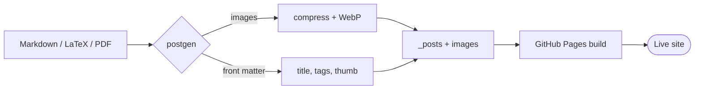
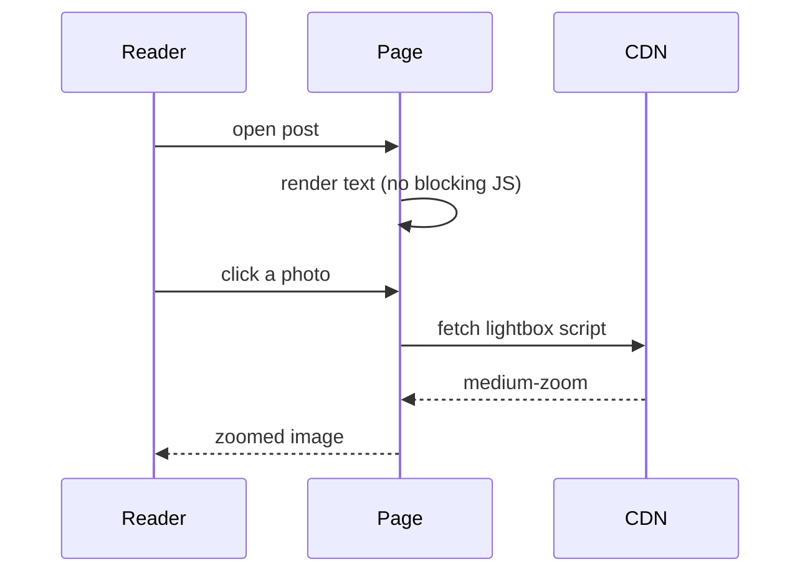

This post exercises three site features at once: MathJax rendering, the
collapsible table of contents (h2 → h3 → h4 tree on the right), and code
blocks with copy buttons. It also serves as a template for future posts.

## Mathematics

### Inline math

The famous identity $e^{i\pi} + 1 = 0$ connects five fundamental constants.
Given a matrix $A \in \mathbb{R}^{m \times n}$, its spectral norm is $\lVert A \rVert_2 = \sigma_{\max}(A)$.

### Display math

$$
\int_{-\infty}^{\infty} e^{-x^2} \, dx = \sqrt{\pi}
$$

$$
\nabla \times \mathbf{B} = \mu_0 \mathbf{J} + \mu_0 \varepsilon_0 \frac{\partial \mathbf{E}}{\partial t}
$$

#### Aligned equations

$$
\begin{aligned}
f(x) &= (x+1)^2 \\
     &= x^2 + 2x + 1
\end{aligned}
$$

#### Matrix

$$
\begin{pmatrix}
\cos\theta & -\sin\theta \\
\sin\theta & \cos\theta
\end{pmatrix}
\begin{pmatrix} x \\ y \end{pmatrix}
=
\begin{pmatrix} x\cos\theta - y\sin\theta \\ x\sin\theta + y\cos\theta \end{pmatrix}
$$

### Long formula

Overly wide display math should scroll horizontally on mobile:

$$
\mathrm{Attention}(Q, K, V) = \mathrm{softmax}\!\left(\frac{QK^{\top}}{\sqrt{d_k}}\right)V, \quad Q \in \mathbb{R}^{n \times d_k},\; K \in \mathbb{R}^{m \times d_k},\; V \in \mathbb{R}^{m \times d_v}
$$

## Code Blocks

Hover any block below — a **Copy** button should appear in its top-right
corner and flash “✓ Copied” when clicked.

### Python

```python
import math

def softmax(xs):
    """Numerically stable softmax."""
    m = max(xs)
    exps = [math.exp(x - m) for x in xs]
    s = sum(exps)
    return [e / s for e in exps]

print(softmax([1.0, 2.0, 3.0]))
```

### C++

```cpp
#include <numeric>
#include <vector>

// dot product with C++20 ranges-friendly style
double dot(const std::vector<double>& a, const std::vector<double>& b) {
    return std::inner_product(a.begin(), a.end(), b.begin(), 0.0);
}
```

### Shell

The `#` comments below must stay comments — they are inside a code fence
and should never be mistaken for headings:

```bash
# build the postgen tool
cd src && make

# generate a post from markdown and publish it
./bin/postgen ~/notes/today.md --tags notes --publish
```

## Table of Contents

With this many nested headings, the right-side TOC (on screens wider than
1240px) shows the h2 chapters first; click ▸ to unfold h3 sections and h4
details level by level. The `−` button minimizes the whole panel, and your
choice is remembered across pages.

### Scroll tracking

Scroll through the post and watch the current section light up in the TOC —
its parent branches unfold automatically.

### Deep nesting

#### Level-four heading A

Some filler text so this section has scrollable height. Lorem ipsum dolor
sit amet, consectetur adipiscing elit, sed do eiusmod tempor incididunt ut
labore et dolore magna aliqua.

#### Level-four heading B

More filler text. Ut enim ad minim veniam, quis nostrud exercitation
ullamco laboris nisi ut aliquip ex ea commodo consequat.

## Diagrams (Mermaid)

Declare `mermaid: true` in the front matter, then open a fenced block tagged
`mermaid`. Diagrams re-render when the light/dark switch is flipped.

### Flowchart



### Sequence diagram



## Writing Conventions

To enable math on a post, add `math: true` to its front matter.
Use `$...$` for inline math and a `$$ ... $$` block on its own lines for
display math. MathJax matches the longer delimiter first, so the two never
collide, and legacy inline `$$...$$` still works (kramdown rewrites it to
`\(...\)`).

One caveat for inline `$...$`: kramdown parses that text *before* MathJax
sees it, so avoid backslash-escaped punctuation (`\,`, `\;`, `\{`, `\|`,
`\\`), straight quotes (`\sigma'`), a `<` directly followed by a letter (it
looks like an HTML tag), and an `_` right after `}` or `)` — write `\lbrace`,
`\lbrack`, `\lVert`, `\ast`, `\tilde a_i` instead, or move the formula into a
`$$` block, where the content is protected verbatim.

Also keep math out of headings: the table of contents is built from the raw
heading text, so a heading formula shows up there unrendered.
