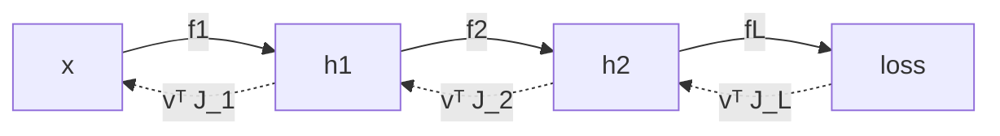

A working review of the mathematics I actually use when reading papers and
writing training code. The goal is a compromise: definitions precise enough
that nothing is hand-waved, but always followed by the engineering reading —
what the object *is* in memory, what it costs, and how it fails numerically.

**Part 1** fixes the vocabulary: vectors, matrices, functions, inner
products and norms, and derivatives (gradient, Jacobian, Hessian), plus a
handful of objects that show up on nearly every page of an ML paper.

## Conventions

Fixing notation once saves a lot of transposes later.

| Symbol | Meaning |
|---|---|
| $a, \alpha$ | scalar |
| $x, y$ | column vector, $x \in \mathbb{R}^{n}$ (i.e. $\mathbb{R}^{n \times 1}$) |
| $A, W$ | matrix, $A \in \mathbb{R}^{m \times n}$ |
| $x_i$ | $i$-th entry of $x$; $a_{ij}$ entry of $A$ |
| $a_j$ | $j$-th **column** of $A$ |
| $A^\top$ | transpose |
| $\langle x, y \rangle$ | inner product |
| $\lVert x \rVert$ | norm (Euclidean unless subscripted) |
| $f_\theta$ | function (model) with parameters $\theta$ |
| $\hat{y}$ | prediction; $y$ ground truth |
| $\mathbb{E}[\cdot]$ | expectation |

Three standing conventions:

1. **Vectors are columns.** A "row vector" is $x^\top$.
2. **Matrices act on the left:** $x \mapsto Ax$. (Deep-learning frameworks
   do the opposite — see [shape discipline](#engineering-note-shape-discipline).)
3. **Indices start at 1** in the math, at 0 in the code. Yes, this is a
   permanent source of off-by-one bugs.

## Vectors

### Vectors and vector spaces

A **real vector space** is a set $V$ with addition and scalar
multiplication satisfying the usual eight axioms (associativity and
commutativity of addition, a zero, additive inverses, a unit scalar,
compatibility of scalar multiplication, and the two distributive laws). We
almost never need the axioms directly; we need the consequence that *linear
combinations are meaningful*.

The concrete space we compute in is

$$
x =
\begin{bmatrix}
x_1 \\
\vdots \\
x_n
\end{bmatrix}
\in \mathbb{R}^{n \times 1},
\qquad
x^\top =
\begin{bmatrix}
x_1 & \cdots & x_n
\end{bmatrix}
\in \mathbb{R}^{1 \times n}.
$$

Everything else in Part 1 lives on top of $\mathbb{R}^n$.

### Span, independence, basis, dimension

Given $v_1, \dots, v_k \in V$:

- **Span:** $\operatorname{span}(v_1,\dots,v_k) = \left\lbrace \sum_{i=1}^{k} c_i v_i : c_i \in \mathbb{R} \right\rbrace$ — the smallest subspace containing them.
- **Linear independence:** $\sum_i c_i v_i = 0 \implies c = 0$. Equivalently, no $v_i$ is redundant.
- **Basis:** an independent spanning set. Every $v \in \operatorname{span}(v_1,\dots,v_k)$ then has *unique* coordinates $c \in \mathbb{R}^k$.
- **Dimension:** the (basis-independent) size of any basis.

The practical payoff: choosing a basis is exactly what turns an abstract
vector into an array of floats. A "feature vector" is a vector *plus a
committed choice of basis* — which is why feature scaling changes results
even though the underlying geometry is "the same".

> **ML reading.** A dataset of $N$ samples with $d$ features is a set of
> $N$ points in $\mathbb{R}^d$. The *manifold hypothesis* says they
> concentrate near a low-dimensional subset; PCA is the linear special case,
> where "low-dimensional" means "a subspace of small dimension".

### Engineering note: shape discipline

Most linear-algebra bugs are shape bugs, not math bugs. Two habits:

```python
# 1. Annotate shapes in comments, and assert them at boundaries.
def attention(Q, K, V):
    # Q: (n, dk)  K: (m, dk)  V: (m, dv)
    assert Q.shape[-1] == K.shape[-1]
    S = Q @ K.T                      # (n, m)
    P = softmax(S / Q.shape[-1]**0.5, axis=-1)
    return P @ V                     # (n, dv)
```

```python
# 2. Never rely on broadcasting to "fix" a rank mismatch silently.
r = y_pred - y_true          # (N, 1) - (N,) -> (N, N)  <-- classic disaster
r = y_pred.reshape(-1) - y_true.reshape(-1)   # explicit, (N,)
```

Also note the **transposed convention** in PyTorch / TensorFlow: a batch is
stored row-wise, $X \in \mathbb{R}^{N \times d}$, and a linear layer
computes $XW + \mathbf{1}b^\top$ with $W \in \mathbb{R}^{d \times k}$.
The math literature writes the same layer as $Wx + b$ with
$W \in \mathbb{R}^{k \times d}$. Both are right; mixing them is not.

## Matrices

### Definition

$$
A =
\begin{bmatrix}
a_{1,1} & \cdots & a_{1,n} \\
\vdots & \ddots & \vdots \\
a_{m,1} & \cdots & a_{m,n}
\end{bmatrix}
\in \mathbb{R}^{m \times n},
\qquad
(A^\top)_{ij} = a_{ji} \in \mathbb{R}^{n \times m}.
$$

### A matrix *is* a linear map

A map $T : \mathbb{R}^n \to \mathbb{R}^m$ is **linear** if
$T(\alpha x + \beta y) = \alpha T(x) + \beta T(y)$. Once bases are fixed,
linear maps and matrices are the same thing: the $j$-th column of $A$ is
$T(e_j)$, the image of the $j$-th basis vector.

$$
A = \begin{bmatrix} T(e_1) & \cdots & T(e_n) \end{bmatrix}.
$$

This is the single most useful sentence in applied linear algebra: *to know
what a matrix does, look at where it sends the basis.*

Composition of maps is matrix multiplication,

$$
(AB)_{ij} = \sum_{k} a_{ik} b_{kj},
$$

which is why the matrix product is associative but not commutative —
composing functions never is.

### Three views of the matrix–vector product

All three readings of $Ax$ are the same arithmetic; you pick whichever
makes the argument short.

$$
\underbrace{(Ax)_i = \sum_{j=1}^{n} a_{ij} x_j}_{\text{entrywise}}
\qquad
\underbrace{Ax = \sum_{j=1}^{n} x_j\, a_j}_{\text{column view}}
\qquad
\underbrace{(Ax)_i = \langle \tilde{a}_i, x \rangle}_{\text{row view}}
$$

where $a_j$ are columns and $\tilde a_i$ rows. The **column view** says
$Ax$ is a linear combination of columns — hence $\operatorname{range}(A)$
is the column space, and "embedding lookup" is just $A$ times a one-hot
vector. The **row view** says each output coordinate is a similarity score
against a learned template — the standard interpretation of a linear
classifier's logits.

### Rank, column space, null space

- $\operatorname{col}(A) = \lbrace Ax \rbrace \subseteq \mathbb{R}^m$, $\quad \ker(A) = \lbrace x : Ax = 0 \rbrace \subseteq \mathbb{R}^n$.
- $\operatorname{rank}(A) = \dim \operatorname{col}(A) = \operatorname{rank}(A^\top)$.
- **Rank–nullity:** $\operatorname{rank}(A) + \dim \ker(A) = n$.

A wide layer with $\operatorname{rank}(A) \ll \min(m,n)$ wastes parameters —
which is precisely the observation LoRA exploits by writing the update as
$\Delta W = BA$ with inner dimension $r \ll d$, costing $r(m+n)$
parameters instead of $mn$.

### Special matrices worth memorizing

| Class | Definition | Why it matters |
|---|---|---|
| Diagonal | $a_{ij} = 0, i \neq j$ | per-coordinate scaling; $O(n)$ apply and invert |
| Symmetric | $A = A^\top$ | real eigenvalues, orthogonal eigenvectors |
| Orthogonal | $A^\top A = I$ | preserves norms and angles, $A^{-1} = A^\top$ |
| Positive definite | $x^\top A x > 0\ \forall x \neq 0$ | defines a metric; Hessian of a strictly convex quadratic |
| Idempotent | $A^2 = A$ | projection |
| Sparse | mostly zeros | cost scales with nonzeros, not with $mn$ |

### Engineering note: cost and memory layout

Dense $A \in \mathbb{R}^{m \times k}$ times $B \in \mathbb{R}^{k \times n}$
costs $2mkn$ FLOPs and is memory-bandwidth bound at small sizes,
compute-bound at large ones. Two consequences:

- **Associativity is free performance.** $(AB)x$ costs $O(mkn)$;
  $A(Bx)$ costs $O(kn + mk)$. Same result, wildly different bills.
- **Row-major storage** (C, NumPy default) means iterating along the last
  index is cache-friendly. A transpose is not free just because it is
  mathematically trivial.

```cpp
// contiguous, unit-stride inner loop over the last index
void matvec(const double* A, const double* x, double* y, int m, int n) {
    for (int i = 0; i < m; ++i) {
        double acc = 0.0;
        for (int j = 0; j < n; ++j) acc += A[i * n + j] * x[j];
        y[i] = acc;
    }
}
```

### Beyond matrices: tensors

A $k$-th order **tensor** here means an element of
$\mathbb{R}^{n_1 \times \cdots \times n_k}$ — an array with $k$ indices,
which is all frameworks mean by the word. Activations are typically
$(N, C, H, W)$ or $(B, T, d)$. Almost every operation is still a
matrix operation applied along some axes, with the rest treated as batch
dimensions. Einstein summation makes that explicit and is worth using:

```python
# batched (B) multi-head (H) attention scores, contracting the feature axis d
S = np.einsum('bhqd,bhkd->bhqk', Q, K)
```

## Functions and maps

### Terminology

A **function** $f : \mathcal{X} \to \mathcal{Y}$ assigns to each
$x \in \mathcal{X}$ (the domain) exactly one $f(x) \in \mathcal{Y}$ (the
codomain). Its **image** $f(\mathcal{X})$ need not be all of
$\mathcal{Y}$. Classification by shape:

| Type | Signature | Example in ML |
|---|---|---|
| Scalar field | $f : \mathbb{R}^n \to \mathbb{R}$ | loss $\mathcal{L}(\theta)$ |
| Vector field / map | $f : \mathbb{R}^n \to \mathbb{R}^m$ | a network layer |
| Operator | $f : \mathbb{R}^{m \times n} \to \mathbb{R}$ | $\det$, $\mathrm{tr}$, regularizer $\lVert W \rVert_F^2$ |
| Functional family | $\lbrace f_\theta \rbrace_{\theta \in \Theta}$ | the hypothesis class |

The last row is the whole point of supervised learning: we do not search over
"all functions", we search over a parameterized family, and training is
optimization over $\Theta$, not over function space.

### Linear, affine, multilinear

- **Linear:** $f(x) = Ax$. Necessarily $f(0) = 0$.
- **Affine:** $f(x) = Ax + b$. This is what a "linear layer" actually is.
- **Multilinear:** linear in each argument separately, e.g.
  $(x, y) \mapsto x^\top A y$. Bilinear forms are the backbone of
  attention and of second-order methods.

A composition of affine maps is affine — hence a deep network without
nonlinearities collapses to a single affine map, no matter its depth. The
nonlinearity $\sigma$ is not a detail; it is the reason depth exists.

### Regularity: continuity, Lipschitz, smoothness

$f$ is **$L$-Lipschitz** on $S$ if

$$
\lVert f(x) - f(y) \rVert \le L \lVert x - y \rVert
\quad \forall x, y \in S .
$$

For a linear map, the smallest such $L$ is the operator norm
$\lVert A \rVert_2$. Lipschitz constants are how we quantify robustness
(a small input perturbation cannot move the output much) and how we get
convergence rates for gradient descent. $f \in C^k$ means $k$ continuous
derivatives; ReLU networks are $C^0$ but not $C^1$, which is why
"the gradient at $0$" is a convention (subgradient), not a derivative.

## Inner products, norms, and geometry

### Inner product

An **inner product** on a real vector space is a map
$\langle \cdot, \cdot \rangle : V \times V \to \mathbb{R}$ that is

1. **symmetric:** $\langle x, y \rangle = \langle y, x \rangle$;
2. **linear in the first argument:** $\langle \alpha x + \beta y, z \rangle = \alpha \langle x, z \rangle + \beta \langle y, z \rangle$;
3. **positive definite:** $\langle x, x \rangle \ge 0$, with equality iff $x = 0$.

On $\mathbb{R}^n$ the standard (dot) product is

$$
\langle x, y \rangle = x^\top y = \sum_{i=1}^{n} x_i y_i .
$$

Two generalizations appear constantly:

$$
\langle x, y \rangle_M = x^\top M y \quad (M \succ 0),
\qquad
\langle A, B \rangle_F = \mathrm{tr}(A^\top B) = \sum_{i,j} a_{ij} b_{ij}.
$$

The first is the Mahalanobis / natural-gradient inner product — it encodes
"which directions count as large". The second treats matrices as vectors and
is what weight decay penalizes.

### Induced norm and Cauchy–Schwarz

Every inner product induces a norm $\lVert x \rVert = \sqrt{\langle x, x \rangle}$, and

$$
\lvert \langle x, y \rangle \rvert \le \lVert x \rVert \, \lVert y \rVert ,
$$

with equality iff $x, y$ are linearly dependent. This lets us *define* the angle

$$
\cos \vartheta = \frac{\langle x, y \rangle}{\lVert x \rVert \lVert y \rVert} \in [-1, 1] ,
$$

which is cosine similarity — geometry recovered from algebra alone, valid in
$\mathbb{R}^{768}$ where intuition has long since given up.

### Orthogonality and projection

$x \perp y$ iff $\langle x, y \rangle = 0$. The orthogonal projection of
$y$ onto a single direction $x$ and onto $\operatorname{col}(A)$
(for $A$ of full column rank) are

$$
\operatorname{proj}_x(y) = \frac{\langle x, y \rangle}{\langle x, x \rangle} x,
\qquad
P_A = A (A^\top A)^{-1} A^\top .
$$

$P_A$ is symmetric and idempotent, and $\hat{y} = P_A y$ is exactly the
least-squares fit: the residual $y - \hat{y}$ is orthogonal to every
column, i.e. to everything the model could have expressed. "Fitting" and
"projecting" are the same verb.

### Norms, and the geometry of sparsity

A **norm** satisfies $\lVert x \rVert = 0 \Leftrightarrow x = 0$,
$\lVert \alpha x \rVert = \lvert \alpha \rvert \lVert x \rVert$, and the
triangle inequality. The $\ell_p$ family:

$$
\lVert x \rVert_p = \Big( \sum_{i=1}^n \lvert x_i \rvert^p \Big)^{1/p}
\ (p \ge 1),
\qquad
\lVert x \rVert_\infty = \max_i \lvert x_i \rvert .
$$

All norms on $\mathbb{R}^n$ are equivalent (each bounds the other up to
constants), so they agree on what "converges". They disagree on *shape*: the
$\ell_1$ ball is a polytope with vertices on the axes, so the optimum of a
smooth loss constrained to it tends to land on a vertex — coordinates exactly
zero. That, not any probabilistic story, is the geometric reason $\ell_1$
induces sparsity.

Matrix norms used everywhere:

$$
\lVert A \rVert_F = \sqrt{\mathrm{tr}(A^\top A)},
\qquad
\lVert A \rVert_2 = \sup_{x \neq 0} \frac{\lVert A x \rVert_2}{\lVert x \rVert_2} = \sigma_{\max}(A) .
$$

The operator norm is the amplification factor: $\lVert Ax \rVert_2 \le \lVert A \rVert_2 \lVert x \rVert_2$.
Chaining that bound over layers is the one-line explanation of exploding and
vanishing signals, and the motivation for spectral normalization.

### Engineering note: similarity in practice

- Cosine similarity = dot product **after** normalization. Normalize once at
  index-build time; then retrieval is a single matrix product $Q E^\top$.
- $\lVert x - y \rVert^2 = \lVert x \rVert^2 - 2\langle x, y \rangle + \lVert y \rVert^2$
  turns a pairwise-distance computation into one GEMM plus two row sums.
  Beware: the cancellation in that identity loses precision in float32 for
  nearby points — clamp negatives to zero before taking the square root.

## Derivatives

### The derivative as a linear map

This is the definition worth internalizing, because it makes every later
formula a shape check rather than a memory test.

> $f : \mathbb{R}^n \to \mathbb{R}^m$ is **differentiable** at $x$ if
> there exists a *linear* map $Df(x) : \mathbb{R}^n \to \mathbb{R}^m$ such
> that $f(x + h) = f(x) + Df(x) h + o(\lVert h \rVert)$ as $h \to 0$.

Spelled out as a limit,

$$
\lim_{h \to 0} \frac{\lVert f(x + h) - f(x) - Df(x)\,h \rVert}{\lVert h \rVert} = 0 .
$$

So a derivative is *the best linear approximation of $f$ near $x$*, and
its matrix is the Jacobian. Two warnings that matter in practice:

- Existence of all partial derivatives does **not** imply differentiability
  (the standard counterexample is $f(x,y) = xy/(x^2+y^2)$, $f(0,0)=0$).
  Continuous partials do imply it, which is the case we always assume.
- Autodiff happily returns a number at points where $f$ is not
  differentiable (e.g. $\mathrm{ReLU}$ at $0$). It reports a convention.

### Partial derivative and Jacobian

For $f = (f_1, \dots, f_m)^\top$, the **Jacobian** collects all first-order
partials:

$$
J_f(x) = \frac{\partial f}{\partial x} =
\begin{bmatrix}
\dfrac{\partial f_1}{\partial x_1} & \cdots & \dfrac{\partial f_1}{\partial x_n} \\
\vdots & \ddots & \vdots \\
\dfrac{\partial f_m}{\partial x_1} & \cdots & \dfrac{\partial f_m}{\partial x_n}
\end{bmatrix}
\in \mathbb{R}^{m \times n} .
$$

Mnemonic: **rows index outputs, columns index inputs** — the shape
$m \times n$ is forced by "it must multiply an input perturbation
$h \in \mathbb{R}^n$ to give an output perturbation in $\mathbb{R}^m$".
This is *numerator layout*; the transposed (denominator) layout is equally
common in the literature, so always check a paper's convention before
trusting a transpose.

### Gradient

When $m = 1$, the Jacobian is a row vector, and the **gradient** is its
transpose — a column vector living in the same space as $x$:

$$
\nabla f(x) = Df(x)^\top =
\begin{bmatrix}
\dfrac{\partial f}{\partial x_1} \\ \vdots \\ \dfrac{\partial f}{\partial x_n}
\end{bmatrix}
\in \mathbb{R}^{n} .
$$

Keeping "gradient = transpose of Jacobian" explicit is what makes
$\theta \leftarrow \theta - \eta \nabla \mathcal{L}(\theta)$ type-correct:
you can only subtract a gradient from a parameter because they inhabit the
same space. (Strictly, the gradient depends on the inner product; with the
standard one we get the familiar formula, and with $\langle\cdot,\cdot\rangle_M$
we get the natural gradient $M^{-1}\nabla f$.)

### Directional derivative and steepest descent

$$
D_u f(x) = \lim_{t \to 0} \frac{f(x + tu) - f(x)}{t} = \langle \nabla f(x), u \rangle .
$$

By Cauchy–Schwarz, over unit $u$ this is maximized at
$u = \nabla f / \lVert \nabla f \rVert$ and minimized at its negation.
Hence: **the negative gradient is the steepest-descent direction** — a
one-line consequence of the inner-product geometry, not a separate fact.
Note it is steepest only with respect to the *chosen* norm, which is exactly
the loophole Adam and natural gradient exploit.

### Chain rule

For $f : \mathbb{R}^n \to \mathbb{R}^k$ and $g : \mathbb{R}^k \to \mathbb{R}^m$,

$$
D(g \circ f)(x) = Dg(f(x)) \, Df(x)
\qquad (m \times k)(k \times n) = (m \times n) .
$$

Composition of derivatives is a product of Jacobians — the shapes cannot
line up any other way. For a scalar loss on a depth-$L$ network
$\mathcal{L} = \ell \circ f_L \circ \cdots \circ f_1$:

$$
\nabla_x \mathcal{L} = J_1^\top J_2^\top \cdots J_L^\top \, \nabla \ell .
$$

Backpropagation is nothing more than choosing to evaluate this product
**right to left**, so that every intermediate is a vector rather than a
matrix.



### Second order: Hessian and Taylor

$$
\nabla^2 f(x) = \left[ \frac{\partial^2 f}{\partial x_i \partial x_j} \right] \in \mathbb{R}^{n \times n},
$$

symmetric whenever $f \in C^2$ (Schwarz's theorem). Second-order Taylor:

$$
f(x + h) = f(x) + \langle \nabla f(x), h \rangle + \tfrac{1}{2} h^\top \nabla^2 f(x)\, h + o(\lVert h \rVert^2).
$$

This is the model behind everything second-order: Newton's step
$-(\nabla^2 f)^{-1}\nabla f$, the reading of curvature as conditioning
($\kappa = \lambda_{\max}/\lambda_{\min}$ controls gradient-descent speed),
and the classification of critical points by the sign pattern of the
eigenvalues (positive definite = local min, indefinite = saddle — and in high
dimension, saddles are the norm).

### Identities worth memorizing

With $a, b$ constant vectors, $A$ a constant matrix:

| Function | Derivative |
|---|---|
| $f(x) = a^\top x$ | $\nabla f = a$ |
| $f(x) = Ax$ | $J = A$ |
| $f(x) = x^\top A x$ | $\nabla f = (A + A^\top)x$, $= 2Ax$ if symmetric |
| $f(x) = \tfrac{1}{2}\lVert x \rVert_2^2$ | $\nabla f = x$ |
| $f(x) = \tfrac{1}{2}\lVert Ax - b \rVert_2^2$ | $\nabla f = A^\top (Ax - b)$ |
| $f(W) = \lVert XW - Y \rVert_F^2$ | $\nabla_W f = 2 X^\top (XW - Y)$ |
| $f(X) = \mathrm{tr}(AX)$ | $\nabla_X f = A^\top$ |
| $f(X) = \log \det X$ | $\nabla_X f = X^{-\top}$ |
| $\sigma(z) = (1 + e^{-z})^{-1}$ | $\mathrm{d}\sigma/\mathrm{d}z = \sigma(1 - \sigma)$ |
| $p = \mathrm{softmax}(z)$ | $J = \operatorname{diag}(p) - p p^\top$ |

Setting $\nabla f = 0$ in the fifth row gives the normal equations
$A^\top A x = A^\top b$ — least squares falls out of one identity.

The last row explains why softmax + cross-entropy is implemented as one
fused op: composing that Jacobian with the cross-entropy gradient collapses
to the famously clean $\hat{y} - y$, avoiding both a matrix build and a
cancellation.

### Engineering note: autodiff never builds the Jacobian

Reverse-mode AD does not compute $J$; it computes **vector–Jacobian
products** $v^\top J$, each at roughly the cost of one forward evaluation.
For $f : \mathbb{R}^n \to \mathbb{R}$ a single VJP with $v = 1$ yields the
whole gradient — cost $O(1)$ passes instead of $O(n)$.

| | Computes | Cost for $f:\mathbb{R}^n \to \mathbb{R}^m$ | Use when |
|---|---|---|---|
| Forward mode (JVP) | $Jv$, one column direction | $n$ passes for full $J$ | $n \ll m$ |
| Reverse mode (VJP) | $v^\top J$, one row direction | $m$ passes for full $J$ | $m \ll n$ |

Training is the extreme case $m = 1$, $n \sim 10^9$ — hence reverse mode,
and hence the memory cost of storing activations for the backward pass. The
same trick gives Hessian-vector products
$\nabla^2 f v = \nabla \langle \nabla f, v \rangle$ without ever forming
the $n \times n$ Hessian.

## Objects you will meet on every page

Compressed previews; each deserves its own part later.

### Eigendecomposition and SVD

$$
A v = \lambda v; \qquad
A = Q \Lambda Q^\top \ (A = A^\top); \qquad
A = U \Sigma V^\top \ (\text{any } A \in \mathbb{R}^{m \times n}).
$$

The SVD always exists and says every linear map is *rotate, scale
coordinatewise, rotate*. Truncating $\Sigma$ gives the best low-rank
approximation in both $\lVert \cdot \rVert_F$ and $\lVert \cdot \rVert_2$
(Eckart–Young) — the mathematical core of PCA, low-rank compression and
spectral analysis of weights.

### Positive semidefiniteness

$A \succeq 0$ iff $x^\top A x \ge 0$ for all $x$, iff all eigenvalues
are $\ge 0$. PSD matrices are the ones that can act as a covariance, a
kernel (Gram) matrix, or the Hessian of a convex function — the same
condition, wearing three hats.

### Convexity and smoothness

$f$ is convex iff its domain is convex and, for differentiable $f$,

$$
f(y) \ge f(x) + \langle \nabla f(x), y - x \rangle \quad \forall x, y ,
$$

i.e. the tangent plane never overestimates. Equivalently
$\nabla^2 f \succeq 0$. $f$ is **$\beta$-smooth** if $\nabla f$ is
$\beta$-Lipschitz, which is what licenses a step size of $1/\beta$.
Neural losses are neither convex nor globally smooth — which is why the
theory sets expectations rather than guarantees, and why gradient clipping
exists.

### Random vectors

$$
\mu = \mathbb{E}[x] \in \mathbb{R}^d, \qquad
\Sigma = \mathbb{E}\big[(x - \mu)(x - \mu)^\top\big] \succeq 0 ,
$$

with the two identities that do most of the work:

$$
\mathbb{E}[Ax + b] = A\mu + b, \qquad
\operatorname{Cov}(Ax + b) = A \Sigma A^\top .
$$

Training minimizes the empirical risk
$\hat{\mathcal{R}}(\theta) = \frac{1}{N}\sum_{i=1}^{N} \ell(f_\theta(x_i), y_i)$
as a stand-in for $\mathcal{R}(\theta) = \mathbb E_{(x,y)} \lbrack \ell(f_\theta(x), y) \rbrack$;
a minibatch gradient is an unbiased estimator of $\nabla \hat{\mathcal{R}}$
with variance $\propto 1/B$. The whole of SGD lives in that sentence.

### Numerical hygiene

- **Never invert.** Solve $Ax = b$ with a factorization (Cholesky for
  $A \succ 0$, QR for least squares). Forming $A^{-1}$ is slower and
  less accurate, and $A^\top A$ squares the condition number
  $\kappa(A) = \sigma_{\max}/\sigma_{\min}$.
- **Log-sum-exp.** Compute
  $\log \sum_i e^{z_i} = z_{\max} + \log \sum_i e^{z_i - z_{\max}}$;
  the naive version overflows for $z_i \gtrsim 88$ in float32.
- **Know your epsilon.** float32 has $\approx 7$ decimal digits; adding
  $10^{-8}$ to a quantity of order $1$ is a no-op, which is why optimizer
  $\varepsilon$ values sit where they do.

## Next

Part 2 will build on this: linear systems and least squares, then
eigen/SVD in full, and the optimization view of training.
