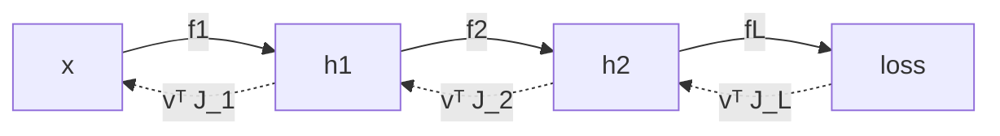
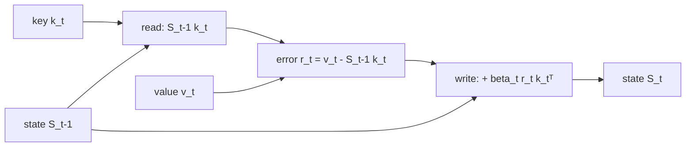

A working review of the mathematics I actually use when reading papers and
writing training code. The goal is a compromise: definitions precise enough
that nothing is hand-waved, but always followed by the engineering reading —
what the object *is* in memory, what it costs, and how it fails numerically.

**Part 1** fixes the vocabulary: vectors, matrices, functions, inner
products and norms, and derivatives (gradient, Jacobian, Hessian), plus a
handful of objects that show up on nearly every page of an ML paper. It ends
with one worked example that uses almost all of it: deriving the Gated
DeltaNet state update from a squared-error loss.

**How to read this.** Every result that gets used later is stated as a
numbered theorem, with a one-line proof or proof sketch and — more usefully —
its **instances** spelled out, the vector case and the matrix case side by
side, since those are the two that keep reappearing. Derivations then cite
them by number, like [T6](#t6). The rule I tried to hold to: nothing is
invoked that was not stated, and nothing is stated that is not later used.

## Conventions

Fixing notation once saves a lot of transposes later.

| Symbol | Meaning |
|---|---|
| $a, \alpha$ | scalar |
| $x, y$ | column vector, $x \in \mathbb{R}^{n}$ (i.e. $\mathbb{R}^{n \times 1}$) |
| $A, W$ | matrix, $A \in \mathbb{R}^{m \times n}$ |
| $x_i$ | $i$-th entry of $x$; $a_{ij}$ entry of $A$ |
| $a_j$ | $j$-th **column** of $A$ |
| $A^\top$ | transpose |
| $\overline{z}$, $x^\ast$ | complex conjugate, conjugate transpose |
| $\langle x, y \rangle$ | inner product |
| $\lVert x \rVert$ | norm (Euclidean unless subscripted) |
| $f_\theta$ | function (model) with parameters $\theta$ |
| $\hat{y}$ | prediction; $y$ ground truth |
| $\mathbb{E}[\cdot]$ | expectation |

Three standing conventions:

1. **Vectors are columns.** A "row vector" is $x^\top$.
2. **Matrices act on the left:** $x \mapsto Ax$. (Deep-learning frameworks
   do the opposite — see [shape discipline](#engineering-note-shape-discipline).)
3. **Indices start at 1** in the math, at 0 in the code. Yes, this is a
   permanent source of off-by-one bugs.

## Vectors

### Vectors and vector spaces

A **real vector space** is a set $V$ with addition and scalar
multiplication satisfying the usual eight axioms (associativity and
commutativity of addition, a zero, additive inverses, a unit scalar,
compatibility of scalar multiplication, and the two distributive laws). We
almost never need the axioms directly; we need the consequence that *linear
combinations are meaningful*.

The concrete space we compute in is

$$
x =
\begin{bmatrix}
x_1 \\
\vdots \\
x_n
\end{bmatrix}
\in \mathbb{R}^{n \times 1},
\qquad
x^\top =
\begin{bmatrix}
x_1 & \cdots & x_n
\end{bmatrix}
\in \mathbb{R}^{1 \times n}.
$$

Everything else in Part 1 lives on top of $\mathbb{R}^n$.

### Span, independence, basis, dimension

Given $v_1, \dots, v_k \in V$:

- **Span:** $\operatorname{span}(v_1,\dots,v_k) = \left\lbrace \sum_{i=1}^{k} c_i v_i : c_i \in \mathbb{R} \right\rbrace$ — the smallest subspace containing them.
- **Linear independence:** $\sum_i c_i v_i = 0 \implies c = 0$. Equivalently, no $v_i$ is redundant.
- **Basis:** an independent spanning set. Every $v \in \operatorname{span}(v_1,\dots,v_k)$ then has *unique* coordinates $c \in \mathbb{R}^k$.
- **Dimension:** the (basis-independent) size of any basis.

The practical payoff: choosing a basis is exactly what turns an abstract
vector into an array of floats. A "feature vector" is a vector *plus a
committed choice of basis* — which is why feature scaling changes results
even though the underlying geometry is "the same".

> **ML reading.** A dataset of $N$ samples with $d$ features is a set of
> $N$ points in $\mathbb{R}^d$. The *manifold hypothesis* says they
> concentrate near a low-dimensional subset; PCA is the linear special case,
> where "low-dimensional" means "a subspace of small dimension".

### Engineering note: shape discipline

Most linear-algebra bugs are shape bugs, not math bugs. Two habits:

```python
# 1. Annotate shapes in comments, and assert them at boundaries.
def attention(Q, K, V):
    # Q: (n, dk)  K: (m, dk)  V: (m, dv)
    assert Q.shape[-1] == K.shape[-1]
    S = Q @ K.T                      # (n, m)
    P = softmax(S / Q.shape[-1]**0.5, axis=-1)
    return P @ V                     # (n, dv)
```

```python
# 2. Never rely on broadcasting to "fix" a rank mismatch silently.
r = y_pred - y_true          # (N, 1) - (N,) -> (N, N)  <-- classic disaster
r = y_pred.reshape(-1) - y_true.reshape(-1)   # explicit, (N,)
```

Also note the **transposed convention** in PyTorch / TensorFlow: a batch is
stored row-wise, $X \in \mathbb{R}^{N \times d}$, and a linear layer
computes $XW + \mathbf{1}b^\top$ with $W \in \mathbb{R}^{d \times k}$.
The math literature writes the same layer as $Wx + b$ with
$W \in \mathbb{R}^{k \times d}$. Both are right; mixing them is not.

## Matrices

### Definition

$$
A =
\begin{bmatrix}
a_{1,1} & \cdots & a_{1,n} \\
\vdots & \ddots & \vdots \\
a_{m,1} & \cdots & a_{m,n}
\end{bmatrix}
\in \mathbb{R}^{m \times n},
\qquad
(A^\top)_{ij} = a_{ji} \in \mathbb{R}^{n \times m}.
$$

### A matrix *is* a linear map

A map $T : \mathbb{R}^n \to \mathbb{R}^m$ is **linear** if
$T(\alpha x + \beta y) = \alpha T(x) + \beta T(y)$.

<a class="thm-anchor" id="t1"></a>**Theorem 1 (Matrix–map correspondence).**
Fix the standard bases. Then

$$
T \;\longmapsto\; \begin{bmatrix} T(e_1) & \cdots & T(e_n) \end{bmatrix}
$$

is a bijection between linear maps $\mathbb{R}^n \to \mathbb{R}^m$ and
matrices in $\mathbb{R}^{m \times n}$, and it turns composition into the
matrix product: the matrix of $S \circ T$ is the product of the matrices.

*Proof.* A linear map is determined by its values on a basis, since
$T(x) = T(\sum_j x_j e_j) = \sum_j x_j T(e_j)$; and $A e_j = a_j$ recovers the
columns from the matrix. Composition: apply both sides to $e_j$. $\square$

*Instances.* An embedding lookup is $A$ times a one-hot vector, i.e. "return
column $j$". A rotation is the matrix whose columns are the rotated basis
vectors. A linear layer stores exactly the images of the input basis.

So: *to know what a matrix does, look at where it sends the basis.* This is
the single most useful sentence in applied linear algebra.

Composition of maps is matrix multiplication,

$$
(AB)_{ij} = \sum_{k} a_{ik} b_{kj},
$$

which by [T1](#t1) is why the matrix product is associative but not
commutative — composing functions is associative, and never commutative.

### Three views of the matrix–vector product

All three readings of $Ax$ are the same arithmetic; you pick whichever
makes the argument short.

$$
\underbrace{(Ax)_i = \sum_{j=1}^{n} a_{ij} x_j}_{\text{entrywise}}
\qquad
\underbrace{Ax = \sum_{j=1}^{n} x_j\, a_j}_{\text{column view}}
\qquad
\underbrace{(Ax)_i = \langle \tilde{a}_i, x \rangle}_{\text{row view}}
$$

where $a_j$ are columns and $\tilde a_i$ rows. The **column view** says
$Ax$ is a linear combination of columns — hence $\operatorname{range}(A)$
is the column space, and "embedding lookup" is just $A$ times a one-hot
vector ([T1](#t1)). The **row view** says each output coordinate is a
similarity score against a learned template — the standard interpretation of a
linear classifier's logits, and the reading that will turn a matrix into a
memory in the [closing example](#the-setup-a-matrix-as-memory).

### Rank, column space, null space

$$
\operatorname{col}(A) = \lbrace Ax \rbrace \subseteq \mathbb{R}^m,
\qquad
\ker(A) = \lbrace x : Ax = 0 \rbrace \subseteq \mathbb{R}^n,
\qquad
\operatorname{rank}(A) = \dim \operatorname{col}(A) .
$$

<a class="thm-anchor" id="t2"></a>**Theorem 2 (Rank–nullity).** For
$A \in \mathbb{R}^{m \times n}$,

$$
\operatorname{rank}(A) + \dim \ker(A) = n ,
\qquad
\operatorname{rank}(A) = \operatorname{rank}(A^\top) .
$$

*Proof sketch.* Extend a basis of $\ker(A)$ to a basis of $\mathbb{R}^n$; the
images of the added vectors form a basis of $\operatorname{col}(A)$. $\square$

Read through [T2](#t2), a layer with $\operatorname{rank}(A) \ll \min(m,n)$ has
a large kernel: it is doing far less work than its $mn$ parameters suggest.
That is the observation LoRA exploits, writing the update as $\Delta W = BA$
with inner dimension $r \ll d$ and paying $r(m+n)$ parameters instead of $mn$.

### Special matrices worth memorizing

| Class | Definition | Why it matters |
|---|---|---|
| Diagonal | $a_{ij} = 0, i \neq j$ | per-coordinate scaling; $O(n)$ apply and invert |
| Symmetric | $A = A^\top$ | real eigenvalues, orthogonal eigenvectors |
| Orthogonal | $A^\top A = I$ | preserves norms and angles, $A^{-1} = A^\top$ |
| Positive definite | $x^\top A x > 0\ \forall x \neq 0$ | defines a metric; Hessian of a strictly convex quadratic |
| Idempotent | $A^2 = A$ | projection |
| Sparse | mostly zeros | cost scales with nonzeros, not with $mn$ |

### Engineering note: cost and memory layout

Dense $A \in \mathbb{R}^{m \times k}$ times $B \in \mathbb{R}^{k \times n}$
costs $2mkn$ FLOPs and is memory-bandwidth bound at small sizes,
compute-bound at large ones. Two consequences:

- **Associativity is free performance.** $(AB)x$ costs $O(mkn)$;
  $A(Bx)$ costs $O(kn + mk)$. Same result, wildly different bills.
- **Row-major storage** (C, NumPy default) means iterating along the last
  index is cache-friendly. A transpose is not free just because it is
  mathematically trivial.

```cpp
// contiguous, unit-stride inner loop over the last index
void matvec(const double* A, const double* x, double* y, int m, int n) {
    for (int i = 0; i < m; ++i) {
        double acc = 0.0;
        for (int j = 0; j < n; ++j) acc += A[i * n + j] * x[j];
        y[i] = acc;
    }
}
```

### Beyond matrices: tensors

A $k$-th order **tensor** here means an element of
$\mathbb{R}^{n_1 \times \cdots \times n_k}$ — an array with $k$ indices,
which is all frameworks mean by the word. Activations are typically
$(N, C, H, W)$ or $(B, T, d)$. Almost every operation is still a
matrix operation applied along some axes, with the rest treated as batch
dimensions. Einstein summation makes that explicit and is worth using:

```python
# batched (B) multi-head (H) attention scores, contracting the feature axis d
S = np.einsum('bhqd,bhkd->bhqk', Q, K)
```

## Functions and maps

### Terminology

A **function** $f : \mathcal{X} \to \mathcal{Y}$ assigns to each
$x \in \mathcal{X}$ (the domain) exactly one $f(x) \in \mathcal{Y}$ (the
codomain). Its **image** $f(\mathcal{X})$ need not be all of
$\mathcal{Y}$. Classification by shape:

| Type | Signature | Example in ML |
|---|---|---|
| Scalar field | $f : \mathbb{R}^n \to \mathbb{R}$ | loss $\mathcal{L}(\theta)$ |
| Vector field / map | $f : \mathbb{R}^n \to \mathbb{R}^m$ | a network layer |
| Operator | $f : \mathbb{R}^{m \times n} \to \mathbb{R}$ | $\det$, $\mathrm{tr}$, regularizer $\lVert W \rVert_F^2$ |
| Functional family | $\lbrace f_\theta \rbrace_{\theta \in \Theta}$ | the hypothesis class |

The last row is the whole point of supervised learning: we do not search over
"all functions", we search over a parameterized family, and training is
optimization over $\Theta$, not over function space.

### Linear, affine, multilinear

- **Linear:** $f(x) = Ax$. Necessarily $f(0) = 0$.
- **Affine:** $f(x) = Ax + b$. This is what a "linear layer" actually is.
- **Multilinear:** linear in each argument separately, e.g.
  $(x, y) \mapsto x^\top A y$. Bilinear forms are the backbone of
  attention and of second-order methods.

A composition of affine maps is affine — hence a deep network without
nonlinearities collapses to a single affine map, no matter its depth. The
nonlinearity $\sigma$ is not a detail; it is the reason depth exists.

### Regularity: continuity, Lipschitz, smoothness

$f$ is **$L$-Lipschitz** on $S$ if

$$
\lVert f(x) - f(y) \rVert \le L \lVert x - y \rVert
\quad \forall x, y \in S .
$$

For a linear map, the smallest such $L$ is the operator norm
$\lVert A \rVert_2$ ([T8](#t8)). Lipschitz constants are how we quantify
robustness (a small input perturbation cannot move the output much) and how we
get convergence rates for gradient descent ([T21](#t21)). $f \in C^k$ means $k$
continuous derivatives; ReLU networks are $C^0$ but not $C^1$, which is why
"the gradient at $0$" is a convention (subgradient), not a derivative.

## Inner products, norms, and geometry

### Inner product

An **inner product** on a real vector space is a map
$\langle \cdot, \cdot \rangle : V \times V \to \mathbb{R}$ that is

1. **symmetric:** $\langle x, y \rangle = \langle y, x \rangle$;
2. **linear in the first argument:** $\langle \alpha x + \beta y, z \rangle = \alpha \langle x, z \rangle + \beta \langle y, z \rangle$;
3. **positive definite:** $\langle x, x \rangle \ge 0$, with equality iff $x = 0$.

(Real, because that is what we compute with; the complex case needs one
change, spelled out in [a note below](#a-note-on-complex-vectors).)

On $\mathbb{R}^n$ the standard (dot) product is

$$
\langle x, y \rangle = x^\top y = \sum_{i=1}^{n} x_i y_i .
$$

Two generalizations appear constantly:

$$
\langle x, y \rangle_M = x^\top M y \quad (M \succ 0),
\qquad
\langle A, B \rangle_F = \mathrm{tr}(A^\top B) = \sum_{i,j} a_{ij} b_{ij}.
$$

The first is the Mahalanobis / natural-gradient inner product — it encodes
"which directions count as large". The second treats matrices as vectors and
is what weight decay penalizes; it is also what lets us differentiate with
respect to a matrix at all ([T11](#t11)).

#### A note on complex vectors

Everything above is stated over $\mathbb{R}$, which is where we compute
almost all of the time. Complex vectors — elements of $\mathbb{C}^n$ —
nevertheless turn up in Fourier transforms, in the eigenvalues of a
non-symmetric real matrix, in rotary position embeddings and in diagonal
state-space models, and the notation changes just enough to cause confusion
later, so here is the dictionary.

| Over $\mathbb{R}^n$ | Over $\mathbb{C}^n$ |
|---|---|
| transpose $x^\top$ | conjugate transpose $x^\ast = \overline{x}^\top$ (also written $x^H$ or $x^\dagger$) |
| $\langle x, y \rangle = x^\top y = \sum_i x_i y_i$ | $\langle x, y \rangle = x^\ast y = \sum_i \overline{x_i} y_i$ |
| $\lVert x \rVert^2 = x^\top x$ | $\lVert x \rVert^2 = x^\ast x = \sum_i \lvert x_i \rvert^2$ |
| symmetric, $A = A^\top$ | Hermitian, $A = A^\ast$ |
| orthogonal, $Q^\top Q = I$ | unitary, $U^\ast U = I$ |
| spectral theorem, $A = Q \Lambda Q^\top$ | spectral theorem, $A = U \Lambda U^\ast$ |

Exactly one axiom changes. Symmetry becomes **conjugate** symmetry,

$$
\langle x, y \rangle = \overline{\langle y, x \rangle} ,
$$

so the form is linear in one argument and conjugate-linear in the other
(*sesquilinear*, "one and a half times linear") rather than bilinear. Which
argument carries the conjugate is pure convention — physics conjugates the
first, much of the math literature the second — and it only ever flips a bar,
so check a paper once and move on.

The reason for all the conjugation is the third axiom. Without it, lengths
break: for $x = (1, i)^\top \in \mathbb{C}^2$,

$$
x^\top x = 1 + i^2 = 0
\quad \text{while} \quad
x^\ast x = \lvert 1 \rvert^2 + \lvert i \rvert^2 = 2 ,
$$

so the unconjugated form assigns length zero to a nonzero vector, and
$\langle x, x \rangle$ is no longer even guaranteed to be real. Conjugation is
the minimal repair that keeps $\langle x, x \rangle \ge 0$, and therefore keeps
geometry.

Once that is in place, nothing else in this post needs relearning:
$\mathbb{C}^n$ with the Hermitian product is a perfectly ordinary inner-product
space, so [T3](#t3)–[T7](#t7) — Cauchy–Schwarz, Riesz, adjoints, projection —
all hold verbatim with $\top$ replaced by $\ast$. Two practical asides worth
remembering:

- **Where the complex numbers come from.** A real *symmetric* matrix has real
  eigenvalues, but a general real matrix does not: its complex eigenvalues
  arrive in conjugate pairs $\lambda = re^{\pm i\theta}$, which is precisely
  rotation by $\theta$ combined with scaling by $r$. That is why a linear
  recurrence can oscillate, and why $\lvert \lambda \rvert < 1$ — not
  $\lambda < 1$ — is the stability condition.
- **Storage.** A complex number is two floats, and complex arithmetic costs
  more per FLOP; libraries therefore keep real signals real and only pay for
  $\mathbb{C}$ where the algorithm demands it (an FFT-based convolution, for
  instance, pays it to turn an $O(n^2)$ operation into $O(n \log n)$).

### Induced norm and Cauchy–Schwarz

Every inner product induces a norm $\lVert x \rVert = \sqrt{\langle x, x \rangle}$.

<a class="thm-anchor" id="t3"></a>**Theorem 3 (Cauchy–Schwarz).** For all
$x, y \in V$,

$$
\lvert \langle x, y \rangle \rvert \le \lVert x \rVert \, \lVert y \rVert ,
$$

with equality if and only if $x$ and $y$ are linearly dependent.

*Proof.* For $y \neq 0$ put $t = \langle x, y \rangle / \lVert y \rVert^2$. Then

$$
0 \le \lVert x - t y \rVert^2 = \lVert x \rVert^2 - \frac{\langle x, y \rangle^2}{\lVert y \rVert^2} ,
$$

which rearranges to the claim; equality forces $x = ty$. $\square$

[T3](#t3) is what makes the angle *definable* in the first place — the
quotient below is guaranteed to land in $[-1,1]$:

$$
\cos \vartheta = \frac{\langle x, y \rangle}{\lVert x \rVert \lVert y \rVert} \in [-1, 1] ,
$$

which is cosine similarity — geometry recovered from algebra alone, valid in
$\mathbb{R}^{768}$ where intuition has long since given up. The same theorem
returns later as the entire content of steepest descent ([T15](#t15)).

### Representing functionals: Riesz

A **linear functional** on $V$ is a linear map $\varphi : V \to \mathbb{R}$ — a
measurement that eats a vector and returns a number. Derivatives are
functionals, which is why the next theorem quietly underwrites the whole
derivative chapter.

<a class="thm-anchor" id="t4"></a>**Theorem 4 (Riesz representation, finite-dimensional).**
Let $V$ be a finite-dimensional real inner-product space and
$\varphi : V \to \mathbb{R}$ linear. Then there exists a **unique** $g \in V$
with

$$
\varphi(h) = \langle g, h \rangle \qquad \text{for all } h \in V .
$$

*Proof.* Take an orthonormal basis $e_1, \dots, e_n$ and set
$g = \sum_i \varphi(e_i) e_i$. Both sides are linear in $h$ and agree on each
$e_i$, hence agree everywhere; uniqueness is [T5](#t5). $\square$

*Instances.*

| $V$ | inner product | a functional looks like | its representer $g$ |
|---|---|---|---|
| $\mathbb{R}^n$ | $x^\top y$ | $h \mapsto c^\top h$ | the column vector $c$ |
| $\mathbb{R}^n$ | $x^\top M y$, $M \succ 0$ | $h \mapsto c^\top h$ | $M^{-1} c$ |
| $\mathbb{R}^{m \times n}$ | $\mathrm{tr}(A^\top B)$ | $H \mapsto \mathrm{tr}(C^\top H)$ | the matrix $C$, same shape |

Row two is worth staring at: **the same functional has different representers
under different inner products.** The measurement is fixed; the vector
representing it is not. That is the seed of natural gradient and of Adam.
Row three says a functional on matrix space is represented by a *matrix of the
same shape* — which is why PyTorch can store `p.grad` alongside `p`.

<a class="thm-anchor" id="t5"></a>**Corollary 5 (Uniqueness of representers).**
If $\langle g_1, h \rangle = \langle g_2, h \rangle$ for every $h \in V$, then
$g_1 = g_2$.

*Proof.* Take $h = g_1 - g_2$, giving $\lVert g_1 - g_2 \rVert^2 = 0$; positive
definiteness finishes it. $\square$

Trivial to prove, used everywhere: [T5](#t5) is the licence to *read an object
off a pairing*, which is the only technique the derivative chapter really uses.

### Adjoints: where every transpose comes from

<a class="thm-anchor" id="t6"></a>**Theorem 6 (Adjoint).** Let $T : V \to W$
be linear between finite-dimensional real inner-product spaces. Then there is
a unique linear map $T^\ast : W \to V$ with

$$
\langle u, T v \rangle_W = \langle T^\ast u, v \rangle_V
\qquad \text{for all } v \in V, \; u \in W .
$$

*Proof.* Fix $u \in W$. Then $v \mapsto \langle u, Tv \rangle_W$ is a linear
functional on $V$, so [T4](#t4) provides a unique representer; define
$T^\ast u$ to be it. Linearity in $u$ follows from uniqueness ([T5](#t5)). $\square$

An adjoint is therefore not a formula to memorize but the answer to one
question: *how do I move an operator to the other side of an inner product?*
These four instances cover essentially every gradient computation in this post.

| $T$ | $T^\ast$ | the identity it produces |
|---|---|---|
| $x \mapsto Ax$ | $u \mapsto A^\top u$ | $\langle u, Ax \rangle = \langle A^\top u, x \rangle$ |
| $H \mapsto Hk$ | $r \mapsto r k^\top$ | $\langle r, Hk \rangle = \langle r k^\top, H \rangle_F$ |
| $X \mapsto BX$ | $Y \mapsto B^\top Y$ | $\langle Y, BX \rangle_F = \langle B^\top Y, X \rangle_F$ |
| $X \mapsto XC$ | $Y \mapsto Y C^\top$ | $\langle Y, XC \rangle_F = \langle Y C^\top, X \rangle_F$ |

Row one is the familiar one and lives entirely in vector space. Row two is the
odd one out and the most useful: the operator maps *matrix* space to *vector*
space ($H \in \mathbb{R}^{d_v \times d_k} \mapsto Hk \in \mathbb{R}^{d_v}$), so
its adjoint goes back the other way, turning an error vector into a matrix.
Its proof is one regrouping of a double sum:

$$
\langle r, Hk \rangle
= \sum_i r_i \sum_j H_{ij} k_j
= \sum_{i,j} H_{ij} \, (r_i k_j)
= \langle r k^\top, H \rangle_F .
$$

Same number, two readings: on the left a pairing in $\mathbb{R}^{d_v}$, on the
right a pairing in matrix space — the subscript $F$ is the only warning that
the space changed. Taking $H = A$, $r = x$, $k = y$ gives the identity in the
form it is usually quoted,

$$
\langle x, A y \rangle = x^\top A y = \mathrm{tr}(A^\top x y^\top) = \langle A, x y^\top \rangle_F ,
$$

and it explains why outer products are everywhere in learning rules.

Which instance to reach for is decided by one question — **which slot holds the
variable?**

| The variable is | Use | The constants leave behind |
|---|---|---|
| a vector, the operator is fixed | row 1 | a **transpose**, $A^\top r$ |
| the matrix itself | row 2 | an **outer product**, $r k^\top$ |

When the matrix *is* the variable you cannot move it across the pairing — it
has to end up in the slot you are reading against. So instead you change which
space you pair in, and the surrounding constants collapse into a rank-one
matrix. Every $k^\top$ dangling at the end of a learning rule is this.

### Orthogonality and projection

$x \perp y$ iff $\langle x, y \rangle = 0$.

<a class="thm-anchor" id="t7"></a>**Theorem 7 (Orthogonal projection).** Let
$U \subseteq V$ be a subspace. Every $y \in V$ splits uniquely as

$$
y = \hat{y} + e, \qquad \hat{y} \in U, \quad e \perp U ,
$$

and $\hat{y}$ is the unique minimizer of $\lVert y - u \rVert$ over $u \in U$.
For a single direction $x$, and for $U = \operatorname{col}(A)$ with $A$ of
full column rank,

$$
\operatorname{proj}_x(y) = \frac{\langle x, y \rangle}{\langle x, x \rangle} x ,
\qquad
\hat{y} = P_A y, \quad P_A = A (A^\top A)^{-1} A^\top ,
$$

and $P_A^\top = P_A = P_A^2$.

*Proof sketch.* Existence and uniqueness of the split come from expanding in an
orthonormal basis of $U$. Minimality: for $u \in U$,
$\lVert y - u \rVert^2 = \lVert e \rVert^2 + \lVert \hat{y} - u \rVert^2$ by
orthogonality (Pythagoras), minimized exactly at $u = \hat{y}$. The formula
follows from forcing $A^\top e = 0$. $\square$

The last line of that proof is the **normal equations**, so [T7](#t7) says
least squares *is* projection: the residual is orthogonal to every column,
i.e. to everything the model could have expressed. "Fitting" and "projecting"
are the same verb. Two instances used later: $P_A$ for least squares, and
$I - kk^\top / \lVert k \rVert^2$, which deletes the $k$ direction and shows up
as the *erase* half of the [closing example](#the-same-update-as-erase-then-write).

### Norms, and the geometry of sparsity

A **norm** satisfies $\lVert x \rVert = 0 \Leftrightarrow x = 0$,
$\lVert \alpha x \rVert = \lvert \alpha \rvert \lVert x \rVert$, and the
triangle inequality. The $\ell_p$ family:

$$
\lVert x \rVert_p = \Big( \sum_{i=1}^n \lvert x_i \rvert^p \Big)^{1/p}
\ (p \ge 1),
\qquad
\lVert x \rVert_\infty = \max_i \lvert x_i \rvert .
$$

All norms on $\mathbb{R}^n$ are equivalent (each bounds the other up to
constants), so they agree on what "converges". They disagree on *shape*: the
$\ell_1$ ball is a polytope with vertices on the axes, so the optimum of a
smooth loss constrained to it tends to land on a vertex — coordinates exactly
zero. That, not any probabilistic story, is the geometric reason $\ell_1$
induces sparsity.

Matrix norms used everywhere:

$$
\lVert A \rVert_F = \sqrt{\mathrm{tr}(A^\top A)},
\qquad
\lVert A \rVert_2 = \sup_{x \neq 0} \frac{\lVert A x \rVert_2}{\lVert x \rVert_2} .
$$

<a class="thm-anchor" id="t8"></a>**Theorem 8 (Operator norm).** For
$A \in \mathbb{R}^{m \times n}$:

1. $\lVert A \rVert_2 = \sigma_{\max}(A)$, the largest singular value ([T18](#t18));
2. $\lVert A x \rVert_2 \le \lVert A \rVert_2 \lVert x \rVert_2$ for every $x$, and $\lVert A \rVert_2$ is the smallest constant with that property;
3. $\lVert AB \rVert_2 \le \lVert A \rVert_2 \lVert B \rVert_2$.

*Proof.* (2) is the definition of the supremum, read forwards and backwards.
(3) applies (2) twice. (1) is read off the SVD $A = U \Sigma V^\top$: the
orthogonal factors preserve norms, so the amplification is decided by the
largest diagonal entry of $\Sigma$. $\square$

So [T8](#t8) is the **amplification factor** of a layer, and it supplies the
Lipschitz constant promised earlier. Chaining (3) across depth is the one-line
explanation of exploding and vanishing signals — a product of factors each
above or below $1$ — and the motivation for spectral normalization.

### Engineering note: similarity in practice

- Cosine similarity = dot product **after** normalization. Normalize once at
  index-build time; then retrieval is a single matrix product $Q E^\top$.
- $\lVert x - y \rVert^2 = \lVert x \rVert^2 - 2\langle x, y \rangle + \lVert y \rVert^2$
  turns a pairwise-distance computation into one GEMM plus two row sums.
  Beware: the cancellation in that identity loses precision in float32 for
  nearby points — clamp negatives to zero before taking the square root.

## Derivatives

This chapter has almost no new content: it is the definition below, plus
Riesz ([T4](#t4)) and adjoints ([T6](#t6)) applied over and over.

### The derivative as a linear map

This is the definition worth internalizing, because it makes every later
formula a shape check rather than a memory test.

**Definition (Fréchet derivative).** $f : \mathbb{R}^n \to \mathbb{R}^m$ is
**differentiable** at $x$ if there exists a *linear* map
$Df(x) : \mathbb{R}^n \to \mathbb{R}^m$ such that

$$
f(x + h) = f(x) + Df(x)\,h + o(\lVert h \rVert), \qquad h \to 0 .
$$

Here $o(\lVert h \rVert)$ means a remainder $r(h)$ with
$\lVert r(h) \rVert / \lVert h \rVert \to 0$ — it vanishes faster than $h$
itself. So a derivative is *the best linear approximation of $f$ near $x$*.

<a class="thm-anchor" id="t9"></a>**Theorem 9 (Uniqueness of the derivative).**
At a given $x$ there is at most one linear map satisfying the definition.

*Proof.* If $L_1, L_2$ both work, subtract the two expansions: the linear map
$L = L_1 - L_2$ satisfies $\lVert L h \rVert = o(\lVert h \rVert)$. Fix a
direction $u$ and put $h = tu$; linearity gives
$\lVert L u \rVert = \lVert L(tu) \rVert / t \to 0$, so $Lu = 0$ for every
$u$. $\square$

[T9](#t9) looks pedantic and is not: it is what makes "expand and match the
linear term" a *proof* rather than a heuristic ([T12](#t12)). One practical
warning in the other direction: autodiff happily returns a number at points
where $f$ is not differentiable (e.g. $\mathrm{ReLU}$ at $0$) — there it
reports a convention, not a derivative.

### Partial derivative and Jacobian

For $f = (f_1, \dots, f_m)^\top$, the **Jacobian** collects all first-order
partials:

$$
J_f(x) = \frac{\partial f}{\partial x} =
\begin{bmatrix}
\dfrac{\partial f_1}{\partial x_1} & \cdots & \dfrac{\partial f_1}{\partial x_n} \\
\vdots & \ddots & \vdots \\
\dfrac{\partial f_m}{\partial x_1} & \cdots & \dfrac{\partial f_m}{\partial x_n}
\end{bmatrix}
\in \mathbb{R}^{m \times n} .
$$

<a class="thm-anchor" id="t10"></a>**Theorem 10 (Jacobian, and when partials suffice).**

1. If $f$ is differentiable at $x$, then the matrix of $Df(x)$ in the standard bases is $J_f(x)$ — so all partials exist and $Df(x)h = J_f(x)h$.
2. If all partials exist and are **continuous** near $x$, then $f$ is differentiable at $x$ (i.e. $f \in C^1 \Rightarrow$ differentiable).
3. The converse of (1) fails: partials can all exist while $f$ is not differentiable, nor even continuous.

*Proof.* (1) Apply the definition with $h = t e_j$ and read the $j$-th column.
(2) Standard: interpolate one coordinate at a time and apply the mean value
theorem to each, using continuity to control the error uniformly.
(3) Counterexample: $f(x, y) = xy/(x^2 + y^2)$ with $f(0,0) = 0$ has both
partials equal to $0$ at the origin, yet is not continuous there — approach
along $y = x$ and it tends to $1/2$. $\square$

So by [T10](#t10) the honest working assumption is $C^1$, which is what (2)
buys: on that class, Jacobians and derivatives are interchangeable.

Mnemonic for the shape: **rows index outputs, columns index inputs** — forced
by "it must multiply an input perturbation $h \in \mathbb{R}^n$ to give an
output perturbation in $\mathbb{R}^m$". This is *numerator layout*; the
transposed (denominator) layout is equally common in the literature, so always
check a paper's convention before trusting a transpose.

### Gradient

<a class="thm-anchor" id="t11"></a>**Theorem 11 (Gradient).** Let $V$ be a
finite-dimensional real inner-product space and $f : V \to \mathbb{R}$
differentiable at $x$. Then there is a unique $\nabla f(x) \in V$ with

$$
Df(x)\,h = \langle \nabla f(x), h \rangle \qquad \text{for all } h \in V .
$$

*Proof.* $Df(x)$ is a linear functional on $V$ — it eats a displacement and
returns a number — so [T4](#t4) applies verbatim. $\square$

That is the entire content of the gradient, and it is worth naming what just
happened: $Df(x)$ and $\nabla f(x)$ are **different objects**. The derivative
is a functional (a row, a covector, "loss per unit displacement"); the
gradient is the vector that represents it, and it lives in the same space as
$x$. Which vector that is depends on the inner product:

| $V$ with its inner product | $\nabla f(x)$ | name |
|---|---|---|
| $\mathbb{R}^n$, $x^\top y$ | $Df(x)^\top$, the column of partials | the familiar gradient |
| $\mathbb{R}^n$, $x^\top M y$ | $M^{-1} Df(x)^\top$ | natural gradient |
| $\mathbb{R}^{m \times n}$, $\langle \cdot, \cdot \rangle_F$ | a matrix shaped like $W$ | [matrix gradient](#gradients-with-respect-to-a-matrix) |

In coordinates with the standard product this is the formula everyone knows:

$$
\nabla f(x) = Df(x)^\top =
\begin{bmatrix}
\dfrac{\partial f}{\partial x_1} \\ \vdots \\ \dfrac{\partial f}{\partial x_n}
\end{bmatrix}
\in \mathbb{R}^{n} .
$$

Two consequences worth stating out loud:

- **Type correctness.** $\theta \leftarrow \theta - \eta \nabla \mathcal{L}(\theta)$
  parses only because [T11](#t11) moved the derivative into $\theta$'s own
  space; $\theta - \eta D\mathcal{L}(\theta)$ would be a type error.
- **The gradient is not canonical.** Row two: the derivative is fixed by $f$,
  but the gradient also depends on the metric you chose. Natural gradient and
  Adam are that freedom being spent deliberately.

#### Reading a gradient off the first-order term

<a class="thm-anchor" id="t12"></a>**Corollary 12 (First-order reading rule).**
If for some $g \in V$

$$
f(x + h) = f(x) + \langle g, h \rangle + o(\lVert h \rVert) ,
$$

then $f$ is differentiable at $x$ and $\nabla f(x) = g$.

*Proof.* $h \mapsto \langle g, h \rangle$ is linear, so the displayed line *is*
the definition of differentiability; [T9](#t9) makes that linear map unique and
[T5](#t5) makes its representer unique. $\square$

This turns the usual "differentiate term by term" ritual into a method:
**expand $f(x+h)$, isolate the part linear in $h$, force it into the shape
$\langle g, h \rangle$, and $g$ is the gradient** — no table lookups, and no
layout conventions to get wrong. Two instances we will need later.

First, $f(x) = x^\top x$. Expanding costs one line:

$$
f(x + h) = (x + h)^\top (x + h) = x^\top x + 2 x^\top h + h^\top h .
$$

The last term is $\lVert h \rVert^2 = o(\lVert h \rVert)$, so the linear part
is $2 x^\top h = \langle 2x, h \rangle$ and [T12](#t12) gives

$$
\nabla_x \, x^\top x = 2x, \qquad \nabla_x \tfrac{1}{2} \lVert x \rVert^2 = x .
$$

Second, $f(x) = \frac{1}{2} \lVert Ax - b \rVert^2$. Put $r = Ax - b$; then
perturbing $x$ by $h$ perturbs the residual by $Ah$, and

$$
f(x + h) = \tfrac{1}{2} \lVert r + Ah \rVert^2
= f(x) + \langle r, Ah \rangle + \tfrac{1}{2} \lVert Ah \rVert^2 .
$$

Now the only move that matters, and it is not a trick: push $A$ off the second
argument and onto the first. That is [T6](#t6), row one,
$\langle r, Ah \rangle = \langle A^\top r, h \rangle$. The linear term is now
in the shape $\langle g, h \rangle$, so by [T12](#t12)

$$
\nabla f(x) = A^\top r = A^\top (Ax - b) .
$$

That transpose was not pulled from a table — it is the adjoint of
$h \mapsto Ah$, and by [T6](#t6) every transpose in every backprop formula
arrives the same way.

### Directional derivative and steepest descent

$$
D_u f(x) = \lim_{t \to 0} \frac{f(x + tu) - f(x)}{t} = \langle \nabla f(x), u \rangle .
$$

By Cauchy–Schwarz, over unit $u$ this is maximized at
$u = \nabla f / \lVert \nabla f \rVert$ and minimized at its negation.
Hence: **the negative gradient is the steepest-descent direction** — a
one-line consequence of the inner-product geometry, not a separate fact.
Note it is steepest only with respect to the *chosen* norm, which is exactly
the loophole Adam and natural gradient exploit.

### Chain rule

<a class="thm-anchor" id="t13"></a>**Theorem 13 (Chain rule).** If
$f : \mathbb{R}^n \to \mathbb{R}^k$ is differentiable at $x$ and
$g : \mathbb{R}^k \to \mathbb{R}^m$ at $f(x)$, then $g \circ f$ is
differentiable at $x$ and

$$
D(g \circ f)(x) = Dg(f(x)) \, Df(x)
\qquad (m \times k)(k \times n) = (m \times n) .
$$

*Proof sketch.* Substitute the expansion of $f$ into that of $g$; the two
leftover terms are still $o(\lVert h \rVert)$ because a linear map cannot
amplify by more than a fixed factor ([T8](#t8)). $\square$

Composition of derivatives is a product of Jacobians — the shapes could not
line up any other way.

<a class="thm-anchor" id="t14"></a>**Corollary 14 (Backprop form).** For a
scalar loss on a depth-$L$ network,
$\mathcal{L} = \ell \circ f_L \circ \cdots \circ f_1$,

$$
\nabla_x \mathcal{L} = J_1^\top J_2^\top \cdots J_L^\top \, \nabla \ell .
$$

*Proof.* [T13](#t13) gives $D\mathcal{L} = D\ell \cdot J_L \cdots J_1$; then
[T11](#t11) says the gradient is the transpose of that row, and transposing a
product reverses the order. Each $J_i^\top$ is the adjoint of layer $i$
([T6](#t6)), which is *why* the backward pass looks like the forward pass run
backwards. $\square$

Backpropagation is nothing more than choosing to evaluate the product in
[T14](#t14) **right to left**, so that every intermediate is a vector rather
than a matrix.



### Directional derivative and steepest descent

<a class="thm-anchor" id="t15"></a>**Theorem 15 (Steepest descent).** Let $f$
be differentiable at $x$ with $\nabla f(x) \neq 0$. Then the directional
derivative satisfies

$$
D_u f(x) = \lim_{t \to 0} \frac{f(x + tu) - f(x)}{t} = \langle \nabla f(x), u \rangle ,
$$

and over unit vectors $u$ it is maximized uniquely at
$u = \nabla f(x) / \lVert \nabla f(x) \rVert$ and minimized at its negation.

*Proof.* The equality is the definition of the derivative with $h = tu$,
followed by [T11](#t11). The extremes are the equality case of
Cauchy–Schwarz ([T3](#t3)): $\lvert \langle \nabla f, u \rangle \rvert \le \lVert \nabla f \rVert$
for unit $u$, with equality exactly when $u$ is parallel to $\nabla f$. $\square$

So **the negative gradient is the steepest-descent direction** is not a
separate fact about optimization; it is [T3](#t3) wearing a different hat. Note
what the proof used: *the* inner product. Change it and the steepest direction
changes with it — which is precisely the loophole natural gradient and Adam
exploit (row two of [T11](#t11)).

### Gradients with respect to a matrix

Parameters are usually matrices, so we need $\nabla_W f$ for
$f : \mathbb{R}^{m \times n} \to \mathbb{R}$. **Nothing new is required** —
that is the point of having stated the theorems in general form:

1. $\mathbb{R}^{m \times n}$ with $\langle \cdot, \cdot \rangle_F$ is a
   finite-dimensional inner-product space, so [T11](#t11) already applies and
   already tells us the gradient is a matrix of the same shape as $W$:

$$
f(W + H) = f(W) + \langle \nabla_W f, H \rangle_F + o(\lVert H \rVert_F) ;
$$

2. [T6](#t6), row two, is the algebra that moves the perturbation into the
   right slot;
3. [T12](#t12) reads the answer off.

Here is the case we need in the closing section. Let
$S \in \mathbb{R}^{d_v \times d_k}$, $k \in \mathbb{R}^{d_k}$,
$v \in \mathbb{R}^{d_v}$, and

$$
L(S) = \frac{1}{2} \lVert v - S k \rVert^2 .
$$

Write $r = v - Sk$ for the residual. Perturbing $S \to S + H$ perturbs the
prediction by $Hk$, hence the residual by $-Hk$:

$$
\begin{aligned}
L(S + H) &= \tfrac{1}{2} \lVert r - Hk \rVert^2 \\
&= \tfrac{1}{2} \lVert r \rVert^2 - \langle r, Hk \rangle + \tfrac{1}{2} \lVert Hk \rVert^2 \\
&= L(S) + \big\langle -r k^\top, \, H \big\rangle_F + o(\lVert H \rVert_F) ,
\end{aligned}
$$

where the third line is [T6](#t6), row two:
$\langle r, Hk \rangle = \langle r k^\top, H \rangle_F$. The expansion is now in
the shape [T12](#t12) wants, so

$$
\nabla_S L = -(v - Sk) \, k^\top \in \mathbb{R}^{d_v \times d_k} .
$$

Shape check: $(d_v \times 1)$ times $(1 \times d_k)$ — correct, as [T11](#t11)
promised, and **rank one** no matter how big $S$ is. That single observation is
what makes the learning rule at the end of this post cost one outer product
instead of a matrix multiply.

### Second order: Hessian and Taylor

<a class="thm-anchor" id="t16"></a>**Theorem 16 (Hessian symmetry, second-order Taylor).**
For $f \in C^2$ near $x$, the Hessian

$$
\nabla^2 f(x) = \left[ \frac{\partial^2 f}{\partial x_i \partial x_j} \right] \in \mathbb{R}^{n \times n}
$$

is **symmetric**, and

$$
f(x + h) = f(x) + \langle \nabla f(x), h \rangle + \tfrac{1}{2} h^\top \nabla^2 f(x)\, h + o(\lVert h \rVert^2).
$$

*Proof sketch.* Symmetry is Schwarz's theorem: continuous mixed partials
commute. The expansion is one-dimensional Taylor applied to
$t \mapsto f(x + th)$ together with [T13](#t13). $\square$

[T16](#t16) is the model behind everything second-order: Newton's step
$-(\nabla^2 f)^{-1}\nabla f$, curvature read as conditioning
($\kappa = \lambda_{\max}/\lambda_{\min}$ controls gradient-descent speed), and
the classification of critical points by the sign pattern of the eigenvalues
([T19](#t19)): positive definite is a local min, indefinite is a saddle — and
in high dimension, saddles are the norm.

### Identities worth memorizing

With $a, b$ constant vectors, $A$ a constant matrix:

| Function | Derivative |
|---|---|
| $f(x) = a^\top x$ | $\nabla f = a$ |
| $f(x) = Ax$ | $J = A$ |
| $f(x) = x^\top A x$ | $\nabla f = (A + A^\top)x$, $= 2Ax$ if symmetric |
| $f(x) = \tfrac{1}{2}\lVert x \rVert_2^2$ | $\nabla f = x$ |
| $f(x) = \tfrac{1}{2}\lVert Ax - b \rVert_2^2$ | $\nabla f = A^\top (Ax - b)$ |
| $f(W) = \lVert XW - Y \rVert_F^2$ | $\nabla_W f = 2 X^\top (XW - Y)$ |
| $f(X) = \mathrm{tr}(AX)$ | $\nabla_X f = A^\top$ |
| $f(X) = \log \det X$ | $\nabla_X f = X^{-\top}$ |
| $L(S) = \frac{1}{2} \lVert v - Sk \rVert^2$ | $\nabla_S L = -(v - Sk) k^\top$ |
| $\sigma(z) = (1 + e^{-z})^{-1}$ | $\mathrm{d}\sigma/\mathrm{d}z = \sigma(1 - \sigma)$ |
| $p = \mathrm{softmax}(z)$ | $J = \operatorname{diag}(p) - p p^\top$ |

Setting $\nabla f = 0$ in the fifth row gives the normal equations
$A^\top A x = A^\top b$ — least squares falls out of one identity.

The last row explains why softmax + cross-entropy is implemented as one
fused op: composing that Jacobian with the cross-entropy gradient collapses
to the famously clean $\hat{y} - y$, avoiding both a matrix build and a
cancellation.

### Engineering note: autodiff never builds the Jacobian

Reverse-mode AD does not compute $J$; it computes **vector–Jacobian
products** $v^\top J$, each at roughly the cost of one forward evaluation.
For $f : \mathbb{R}^n \to \mathbb{R}$ a single VJP with $v = 1$ yields the
whole gradient — cost $O(1)$ passes instead of $O(n)$.

| | Computes | Cost for $f:\mathbb{R}^n \to \mathbb{R}^m$ | Use when |
|---|---|---|---|
| Forward mode (JVP) | $Jv$, one column direction | $n$ passes for full $J$ | $n \ll m$ |
| Reverse mode (VJP) | $v^\top J$, one row direction | $m$ passes for full $J$ | $m \ll n$ |

Training is the extreme case $m = 1$, $n \sim 10^9$ — hence reverse mode,
and hence the memory cost of storing activations for the backward pass. The
same trick gives Hessian-vector products
$\nabla^2 f v = \nabla \langle \nabla f, v \rangle$ without ever forming
the $n \times n$ Hessian.

## Objects you will meet on every page

Stated, not developed — each deserves its own part later. They are here because
the closing example and Part 2 cite them.

### Eigendecomposition and SVD

<a class="thm-anchor" id="t17"></a>**Theorem 17 (Spectral theorem, real symmetric).**
If $A = A^\top \in \mathbb{R}^{n \times n}$, then

$$
A = Q \Lambda Q^\top, \qquad Q^\top Q = I, \quad \Lambda = \operatorname{diag}(\lambda_1, \dots, \lambda_n) \text{ real} :
$$

the eigenvalues are real and there is an orthonormal basis of eigenvectors.

*Proof sketch.* The Rayleigh quotient $x^\top A x$ attains a maximum on the
unit sphere; a maximizer is an eigenvector, $A$ maps its orthogonal complement
into itself, and one inducts on dimension. $\square$

<a class="thm-anchor" id="t18"></a>**Theorem 18 (SVD, and Eckart–Young).**
Every $A \in \mathbb{R}^{m \times n}$ factors as

$$
A = U \Sigma V^\top, \qquad U, V \text{ orthogonal}, \quad \sigma_1 \ge \cdots \ge \sigma_p \ge 0 .
$$

Moreover the truncation $A_r = \sum_{i \le r} \sigma_i u_i v_i^\top$ minimizes
$\lVert A - B \rVert$ over all $B$ with $\operatorname{rank}(B) \le r$,
simultaneously for $\lVert \cdot \rVert_F$ and $\lVert \cdot \rVert_2$.

*Proof sketch.* Apply [T17](#t17) to $A^\top A \succeq 0$: its orthonormal
eigenvectors give $V$, with $\sigma_i = \sqrt{\lambda_i}$ and
$u_i = A v_i / \sigma_i$. Optimality of the truncation is Eckart–Young. $\square$

So every linear map is *rotate, scale coordinatewise, rotate*. [T18](#t18) is
the mathematical core of PCA, of low-rank compression (the $r$ in LoRA,
[T2](#t2)), and of the operator norm ([T8](#t8)).

### Positive semidefiniteness

<a class="thm-anchor" id="t19"></a>**Theorem 19 (PSD equivalences).** For
symmetric $A$ the following are equivalent: (1) $x^\top A x \ge 0$ for all $x$;
(2) every eigenvalue is $\ge 0$; (3) $A = B^\top B$ for some $B$.

*Proof.* (1) $\Leftrightarrow$ (2): in eigen-coordinates ([T17](#t17))
$x^\top A x = \sum_i \lambda_i c_i^2$. (2) $\Rightarrow$ (3): take
$B = \Lambda^{1/2} Q^\top$. (3) $\Rightarrow$ (1):
$x^\top B^\top B x = \lVert Bx \rVert^2 \ge 0$. $\square$

PSD matrices are exactly the ones that can act as a covariance, as a kernel
(Gram) matrix, or as the Hessian of a convex function — by [T19](#t19) that is
one condition wearing three hats.

### Convexity and smoothness

<a class="thm-anchor" id="t20"></a>**Theorem 20 (First-order characterization of convexity).**
Let $f$ be differentiable on a convex domain. Then $f$ is convex if and only if

$$
f(y) \ge f(x) + \langle \nabla f(x), y - x \rangle \qquad \forall x, y ,
$$

i.e. every tangent plane underestimates $f$; and for $f \in C^2$, if and only
if $\nabla^2 f(x) \succeq 0$ everywhere.

*Proof sketch.* Restrict to the segment joining $x$ and $y$ to reduce to one
dimension; the second-order form combines [T16](#t16) with [T19](#t19). $\square$

<a class="thm-anchor" id="t21"></a>**Theorem 21 (Descent lemma).** If
$\nabla f$ is $L$-Lipschitz ($f$ is **$L$-smooth**), then

$$
f(y) \le f(x) + \langle \nabla f(x), y - x \rangle + \frac{L}{2} \lVert y - x \rVert^2 ,
$$

and therefore the step $y = x - \frac{1}{L} \nabla f(x)$ satisfies

$$
f(y) \le f(x) - \frac{1}{2L} \lVert \nabla f(x) \rVert^2 .
$$

*Proof sketch.* Integrate $\nabla f$ along the segment and bound the
integrand's deviation using the Lipschitz property; then substitute the
step. $\square$

[T21](#t21) is where step sizes come from: $1/L$ is guaranteed to make
progress, and beyond $2/L$ the guarantee reverses — a bound we will see
realized *exactly* in the [closing example](#why-a-step-size-of-one-is-the-natural-scale).
Neural losses are neither convex nor globally smooth, which is why the theory
sets expectations rather than guarantees, and why gradient clipping exists.

### Random vectors

$$
\mu = \mathbb{E}[x] \in \mathbb{R}^d, \qquad
\Sigma = \mathbb{E}\big[(x - \mu)(x - \mu)^\top\big] \succeq 0 ,
$$

with the two identities that do most of the work:

$$
\mathbb{E}[Ax + b] = A\mu + b, \qquad
\operatorname{Cov}(Ax + b) = A \Sigma A^\top .
$$

Training minimizes the empirical risk
$\hat{\mathcal{R}}(\theta) = \frac{1}{N}\sum_{i=1}^{N} \ell(f_\theta(x_i), y_i)$
as a stand-in for $\mathcal{R}(\theta) = \mathbb E_{(x,y)} \lbrack \ell(f_\theta(x), y) \rbrack$;
a minibatch gradient is an unbiased estimator of $\nabla \hat{\mathcal{R}}$
with variance $\propto 1/B$. The whole of SGD lives in that sentence.

### Numerical hygiene

- **Never invert.** Solve $Ax = b$ with a factorization (Cholesky for
  $A \succ 0$, QR for least squares). Forming $A^{-1}$ is slower and
  less accurate, and $A^\top A$ squares the condition number
  $\kappa(A) = \sigma_{\max}/\sigma_{\min}$.
- **Log-sum-exp.** Compute
  $\log \sum_i e^{z_i} = z_{\max} + \log \sum_i e^{z_i - z_{\max}}$;
  the naive version overflows for $z_i \gtrsim 88$ in float32.
- **Know your epsilon.** float32 has $\approx 7$ decimal digits; adding
  $10^{-8}$ to a quantity of order $1$ is a no-op, which is why optimizer
  $\varepsilon$ values sit where they do.

## Worked example: the delta rule behind Gated DeltaNet

Time to spend the vocabulary — and to check the claim made at the top, that
nothing gets invoked here that was not proved above. The claim to derive is
that the squared-error objective

$$
L_t(S) = \frac{1}{2} \lVert v_t - S k_t \rVert^2
$$

leads to the state update

$$
S_t = S_{t-1} + \beta_t (v_t - S_{t-1} k_t) k_t^\top ,
$$

which is the recurrence at the heart of DeltaNet and, with one extra scalar,
of Gated DeltaNet (GDN).

### The setup: a matrix as memory

Let the state be a matrix $S \in \mathbb{R}^{d_v \times d_k}$ that answers a
key with a value,

$$
\hat{v} = S k ,
$$

i.e. a **linear associative memory**. This is the row view of the
matrix–vector product ([T1](#t1)): row $i$ of $S$ is a template, and
$\hat v_i = \langle \tilde s_i, k \rangle$ scores the key against it. The
whole model is one linear map, and the *learning* problem is to keep updating
that map online as new pairs $(k_t, v_t)$ arrive — without storing the past,
unlike attention, which keeps every key and value.

"Store the pair $(k_t, v_t)$" then means "make $S k_t$ close to $v_t$", and
the least-squares way to say that is precisely $L_t$ above. Note it is a
function of a *matrix*, so the space we are optimizing over is
$\mathbb{R}^{d_v \times d_k}$ with the Frobenius inner product — which is
exactly the setting [T11](#t11) was stated in.

### One gradient step is the update

The gradient was computed above by [T6](#t6) and [T12](#t12), and it is rank
one:

$$
\nabla_S L_t(S) = -(v_t - S k_t) k_t^\top .
$$

Now take a single step of gradient descent, starting from the state we
already have and using step size $\beta_t$:

$$
\begin{aligned}
S_t &= S_{t-1} - \beta_t \nabla_S L_t(S_{t-1}) \\
&= S_{t-1} + \beta_t (v_t - S_{t-1} k_t) k_t^\top .
\end{aligned}
$$

That is the whole derivation — and every symbol now has a provenance:

- $r_t = v_t - S_{t-1} k_t$ is the **prediction error**: what the memory
  currently answers versus what it should. This is the "delta", and the rule
  is Widrow–Hoff's delta rule from 1960 wearing modern notation.
- the trailing $k_t^\top$ is **not decoration**: by [T6](#t6), row two, it is
  the adjoint of $H \mapsto H k_t$, the unique linear map that carries an error
  in $\mathbb{R}^{d_v}$ back to a correction in
  $\mathbb{R}^{d_v \times d_k}$ — routed only to the coordinates that produced
  the error.
- subtracting a gradient from a state is type-correct only because
  [T11](#t11) put $\nabla_S L_t$ in the same space as $S$, with the same shape.
- $\beta_t$ is a **learning rate**, so we should be able to say what value is
  right. We can, exactly — that is [T20](#t20) and [T21](#t21) below.



### Why a step size of one is the natural scale

$L_t$ is a convex quadratic in $S$ — convex because its Hessian is PSD
([T19](#t19), [T20](#t20)) — so we need not guess the step size. Apply the new
state to the very key we just wrote, using that
$k_t^\top k_t = \lVert k_t \rVert^2$ is a scalar:

$$
\begin{aligned}
v_t - S_t k_t &= v_t - S_{t-1} k_t - \beta_t (v_t - S_{t-1} k_t) k_t^\top k_t \\
&= \big(1 - \beta_t \lVert k_t \rVert^2\big) (v_t - S_{t-1} k_t) .
\end{aligned}
$$

One step therefore multiplies the error on $k_t$ by
$1 - \beta_t \lVert k_t \rVert^2$, and the consequences read off immediately:

| Step size | Effect on the error |
|---|---|
| $\beta_t = 1/\lVert k_t \rVert^2$ | error becomes exactly $0$, so $S_t k_t = v_t$ — a perfect write |
| $\beta_t \in (0, 1/\lVert k_t \rVert^2)$ | error shrinks but survives — a partial write |
| $\beta_t = 2/\lVert k_t \rVert^2$ | error keeps its magnitude, flips sign — no progress |
| $\beta_t > 2/\lVert k_t \rVert^2$ | error grows — divergence |

With normalized keys, $\lVert k_t \rVert = 1$, the perfect write is simply
$\beta_t = 1$, and $\beta_t \in (0, 1)$ interpolates: it is exactly *how much
of the old association to overwrite*. That is why implementations put a
sigmoid on $\beta_t$ and normalize $k_t$ — the parameterization then cannot
leave the stable region.

This is not a coincidence, it is [T21](#t21) coming out exact. In
$\mathrm{vec}$ coordinates, $S k = (k^\top \otimes I) \mathrm{vec}(S)$, so

$$
L_t(S) = \tfrac{1}{2} \big\lVert v_t - (k_t^\top \otimes I) \mathrm{vec}(S) \big\rVert^2,
\qquad
\nabla^2 = (k_t k_t^\top) \otimes I ,
$$

whose only nonzero eigenvalue is $\lVert k_t \rVert^2$ ([T17](#t17)). So $L_t$
is $L$-smooth with $L = \lVert k_t \rVert^2$, and the two thresholds
[T21](#t21) predicts — guaranteed progress at $1/L$, guarantee lost past $2/L$ —
are exactly the perfect-write and divergence rows of the table above. For a
quadratic the descent lemma is tight, which is why "$1/L$" is not merely safe
here but optimal.

### The same update, as erase-then-write

Regroup the update without assuming anything:

$$
S_t = S_{t-1} \big( I - \beta_t k_t k_t^\top \big) + \beta_t v_t k_t^\top .
$$

(Expand it: the cross term is $-\beta_t S_{t-1} k_t k_t^\top$, which is what
the previous form has.) Read this version operationally. When
$\beta_t \lVert k_t \rVert^2 = 1$, the factor $I - \beta_t k_t k_t^\top$ is
precisely the orthogonal projector of [T7](#t7) onto the complement of $k_t$:
it annihilates the $k_t$ direction and leaves everything perpendicular to it
untouched. So the step is literally:

1. **erase** whatever the memory currently associates with $k_t$,
2. **write** $v_t$ in the freed slot.

Because the correction is rank one, no other direction in $S$ is disturbed —
that is what makes this a memory with targeted editing, rather than a
decaying running average like a plain linear-attention state
($S_t = S_{t-1} + v_t k_t^\top$, which only ever accumulates).

### The gate: from DeltaNet to GDN

The delta rule as derived never forgets: information leaves $S$ only when
something is written on the same key. Gated DeltaNet adds a data-dependent
scalar decay $\alpha_t \in (0, 1)$ on the retained state:

$$
S_t = \alpha_t S_{t-1} \big( I - \beta_t k_t k_t^\top \big) + \beta_t v_t k_t^\top .
$$

The division of labour is clean, and it is why both gates exist:

- $\beta_t$ — **write precision**: how completely this key is overwritten
  (from the least-squares step-size analysis above);
- $\alpha_t$ — **retention**: a global multiplicative forget, which is what
  Mamba-style state-space models use and what the pure delta rule lacks.

Both are emitted by the network from the current token, which is all
"gated" means: the optimizer-like recurrence gets its step size and its decay
from the data rather than from a hyperparameter.

### What it costs

Per step: one matvec $S_{t-1} k_t$, one outer product, one scaled add —
$O(d_k d_v)$ time and $O(d_k d_v)$ memory, with **no dependence on sequence
length**. Nothing here ever forms a Jacobian, a Hessian or an inverse: the
gradient was available in closed form as a rank-one outer product, which is the
practical dividend of [T6](#t6) and [T12](#t12).

```python
def delta_step(S, k, v, beta, alpha=1.0):
    """One GDN state update. alpha=1 recovers the plain delta rule."""
    # S: (dv, dk) state    k: (dk,) key    v: (dv,) value
    r = v - alpha * (S @ k)              # error against the retained state
    return alpha * S + beta * np.outer(r, k)

# perfect write: with alpha=1 and beta = 1/||k||^2, the key reads back exactly
S1 = delta_step(S, k, v, beta=1.0 / (k @ k))
assert np.allclose(S1 @ k, v)
```

The sequential form above is latency-bound on a GPU — $T$ dependent steps of
tiny work. Production kernels therefore process a chunk of steps at once by
unrolling the recurrence into matrix products (the WY-style representation),
which is [T1](#t1)'s associativity reappearing as a throughput trick: same
arithmetic, different parenthesization, orders of magnitude of difference.

### What was actually used

The whole example rests on eight of the numbered results, which is the point:

| Step | Result used |
|---|---|
| $S$ as an associative memory, row view | [T1](#t1) |
| the gradient lives in matrix space, same shape as $S$ | [T11](#t11) |
| $\langle r, Hk \rangle = \langle r k^\top, H \rangle_F$ | [T6](#t6) |
| reading $\nabla_S L$ off the expansion | [T12](#t12) |
| $L_t$ convex, Hessian PSD | [T19](#t19), [T20](#t20) |
| the eigenvalue $\lVert k_t \rVert^2$ | [T17](#t17) |
| step sizes $1/L$ and $2/L$ | [T21](#t21) |
| $I - k k^\top / \lVert k \rVert^2$ erases the key | [T7](#t7) |

## Next

Part 2 will build on this: linear systems and least squares, then
eigen/SVD in full, and the optimization view of training — including what
changes when the one-step rule above is replaced by many steps on many pairs
at once.
